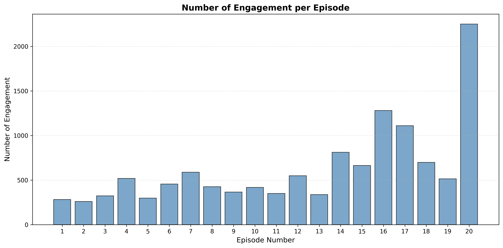
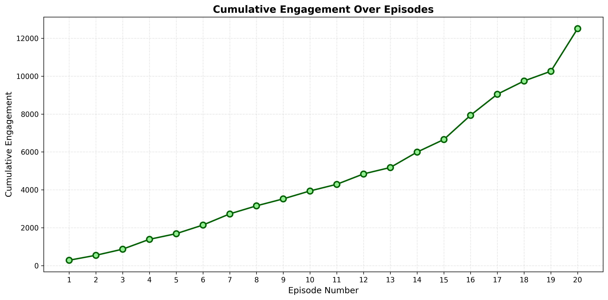
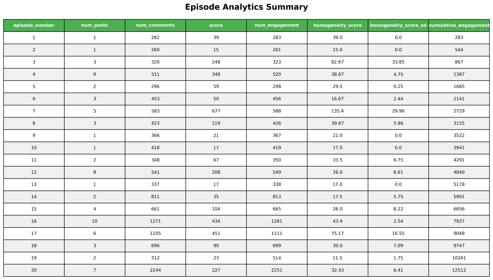
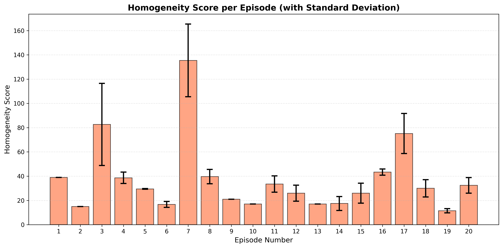

# Love Island Australia – Season 7 Episode 1-20
## Season Performance and Audience Sentiment Report  
**Data Source:** r/LoveIslandAus  
**Prepared by:** Marsya Amanda
**Date:** 04/12/2025
**Tools:** Python, pandas, matplotlib

---

## 1. Executive Summary

This report analyses the audience performance and sentiment dynamics of *Love Island Australia Season 7* using Reddit engagement from the r/LoveIslandAus community as a proxy for live and VOD audience interest.

Across the season, a total of **74 threads** and **12438 comments** were analysed, covering all **20 broadcast episodes** between **October 27, 2025 and November 27, 2025**. Overall engagement peaked during **Episode 20**, which recorded **2251 total interactions**, representing approximately **359.81% above the running seasonal average**.

Sentiment remained largely **homogenous** during the early stages of the season before becoming more **mixed** following **contestant departures and production programming**. Episodes featuring **conflicts** consistently generated the strongest discussion volumes.

**Key Findings:**

* Peak audience engagement occurred in **Episode 20**, driven by **recouplings and mass-dumping**.
* Mid-season discussion volume **increased** by approximately **28.72%** relative to launch.
* Audience sentiment showed **moderate volatility**, with notable volatile sentiments in **Episodes 19 and 20**.
* Episodes with low sentiment homgeneity produced on average **23×** the engagement of high sentiment homogeneity episode.

**Business Implication:**  
The findings suggest that **conflict-driven storytelling, notable contestants, and marketing** play a critical role in sustaining audience attention across the broadcast window.

---

## 2. Data & Methodology

### 2.1 Data Source  
Reddit discussion data was collected from the r/LoveIslandAus subreddit, covering the full broadcast period of *Love Island Australia Season 7* (**October 27, 2025 and November 27, 2025**).

### 2.2 Data Collection  
Posts were collected using BeautifulSoup on the r/LoveIslandAus subreddit with filters applied for:

* Episode identifiers (e.g. “Episode”, “Ep”, “E0X”)
* Season references (“Season 7”, “S7”)
* Minimum posting date of **October 27, 2025**
* Sorted by newest

A total of **74 posts** met inclusion criteria.

### 2.3 Metrics Defined

* **Engagement Volume:** Total posts + comments per episode  
* **Attention Intensity:** Total upvotes per episode  
* **Cumulative Engagement:** Running total across episodes  
* **Sentiment Homogeneity:** Standard deviation of sentiment across threads per episode  

### 2.4 Limitations  
Reddit users represent a **self-selecting and highly engaged subset** of the total viewing audience. Engagement metrics reflect **relative interest and reaction**, not official ratings or streaming volume. Sentiment classification was performed through manual qualitative analysis.

---

## 3. Season-Level Performance Overview

### 3.1 Engagement Across the Season  
Figure 1 illustrates total Reddit engagement by episode. Engagement in Week 1 (Episodes 1–4) averaged **346.75 interactions per episode**, before **increasing** during the mid-season block.

> 

The highest engagement was observed in **Episode 20**, which recorded **2251 interactions**, while the lowest engagement occurred in **Episode 2** with **261 interactions**.

### 3.2 Cumulative Engagement  
Cumulative engagement trends are shown in Figure 2. Growth remained approximately **linear** across the season, with inflection points unclear.

> 

---

## 4. Episode-Level Performance Analysis

Table 1 summarises episode-level engagement and sentiment metrics across Season 7.

> 

**Top Performing Episodes:**  

* Episode 20: **2251 interactions**, sentiment homogeneity **32.4**, driven by **post-dumping and recoupling**  
* Episode 16: **1281 interactions**, sentiment homogeneity **43.4**, driven by **coupling ups**  

**Lowest Performing Episodes:**  

* Episode 1 & 2: **283 & 261 interactions**, associated with **season set up**  

Episodes featuring **recouplings/eliminations** consistently outperformed episodes centred on **routine activities and season set up**.

---

## 5. Audience Sentiment Homogeneity Analysis by Episode

Figure 3 presents the sentiment homogeneity score by episode. Sentiment homogeneity measures the **consistency of audience opinion within each discussion thread**. Sentiment homogeneity was scored by finding the average score (ie. upvotes) of posts on each episode.

> 

Week 1 sentiment homogeneity averaged **42.8**, before decreasing to an average of **35.9** in subsequent weeks. This suggests that opinions became more polarised as viewers formed their own opinions on each contestant and contestant outcomes are announced. Homogeneity was highest in **Episode 7**, suggesting strong consensus with the first round of coupling decisions and lowest in **Episode 19**, indicating polarised viewer reactions.

Episodes with **low homogeneity** frequently coincided with **superfan voting and contestant decisions**.

---

## 6. Conclusion

Reddit audience engagement for *Love Island Australia Season 7* demonstrates a **strong** performance profile, with consistently growing attention peaks as the narrative unfolds. However, low engagement levels in the beginning may indicate weak marketing at launch.

These results reinforce the importance of **strategic narrative pacing and promotional timing** in maximising both live engagement and sustained VOD interest.
